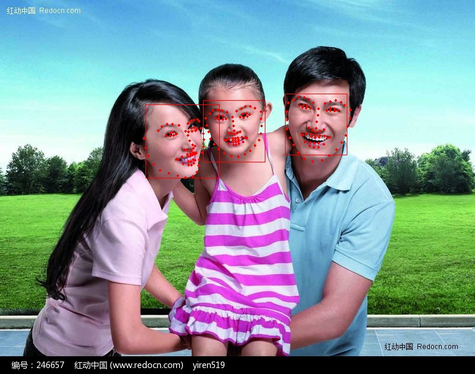

This is a project predict face landmarks (68 points).
- Implementation of the Vanilla CNN described in the paper Yue Wu and Tal
Hassner, "Facial Landmark Detection with Tweaked Convolutional Neural
Networks", arXiv preprint arXiv:1511.04031, 12 Nov. 2015. See project page for
more information about this project.
http://www.openu.ac.il/home/hassner/projects/tcnn_landmarks/

Written by Ishay Tubi : ishay2b [at] gmail [dot] com
https://www.linkedin.com/in/ishay2b

--------
# VanillaCNN based face-landmark-localization
- Model Size : 3.3MB.
- Speed : 5ms per face on i5-2.7GHz CPU.
- [VanillaCNN](https://github.com/ishay2b/VanillaCNN)

## Install
- [caffe](https://github.com/BVLC/caffe)
- [dlib face detector](http://dlib.net/)
- add libdlib.a to your project lib path
- add face_lardmark.cpp to your caffe project example folder
- opencv

## Usage
- set Caffe and Dlib path in CMakeLists.txt
- CPP Demo : ./face_lardmark 
- Python Demo: python face_landmark.py (created by [jiangwqcooler](https://github.com/jiangwqcooler))

## notice
- This model was trained on dlib face detector. Other face detector may not get landmark result as good as dlib

## Result

